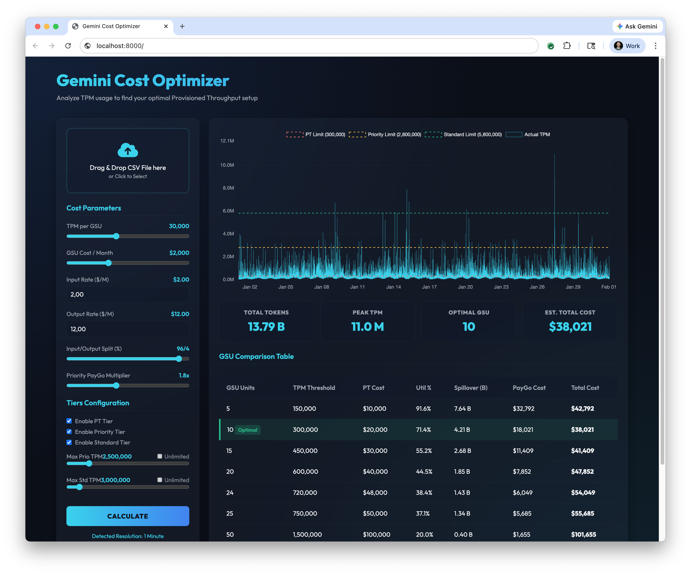

# Vertex AI Gemini Cost Calculator App

This client-side single-page application is designed to analyze LLM token usage (Tokens Per Minute - TPM) timeseries data to calculate and find optimal Provisioned Throughput configurations on Gemini Vertex AI.

🚀 **Try it live:** [https://antonpp.github.io/gemini-cost-calc/](https://antonpp.github.io/gemini-cost-calc/)



## ⚙️ Running Locally

Clone the repository and start a local server:
```bash
git clone https://github.com/antonpp/gemini-cost-calc.git
cd gemini-cost-calc
python3 -m http.server 8000
```
Then navigate to **[http://localhost:8000/](http://localhost:8000/)** or use the test URL **[http://localhost:8000/?test=true](http://localhost:8000/?test=true)**!

---

## 🚀 Core Functionalities
1.  **Automatic Resolution Sweeps**: Dynamically evaluates timestamps offsets detecting bucket intervals (e.g., 1-minute, 5-minute) and translates metrics reducing multipliers natively accurately.
2.  **True Optima Solvers**: Employs continuous numerical Grid Search loops finding exact integer continuous parameters balancing provisioned nodes workloads pricing balancing exact boundaries setups securely setup streams efficiently.
3.  **Surrounding Density Benchmarks**: Automatically populates comparison tables overlaid focusing dense candicates matrices layouts accurately.

## ✨ Features
-   **Dashboard Loaders**: Drag-and-drop or select target CSV files natively.
-   **Box Drag-to-Zoom Visuals**: Drag cursors over timeframes zooming focuses continuous timelines frames setup. Click `Reset Zoom` snaps ranges directly.
-   **Dynamic Threshold Indicators**: View layouts synchronization synchronization overlay overlays overlay overlay overlay accurately.

## 📂 Project Anatomy
-   **Dashboard Views**: `index.html`, `style.css`, `app.js` (Zero dependencies server layout frameworks frameworks strictly single frame setups).
-   **Local Samples** (`my_sample_csv/`): Private buffers storage zone (Gitignored locally securely).
-   **Utilities** (`utils/`): Scripts (such as `fix_csv.py`) supporting mapping alternative formatting matrices schemas pipelines seamlessly seamless setups.

## 📊 Expected CSV Format
The dashboard expects a CSV containing at least `time` and `tpm` headers:
```csv
time,tpm
2026-03-12T10:00:00Z,4500000
2026-03-12T10:01:00Z,4720000
2026-03-12T10:02:00Z,5100000
```
> [!NOTE]
> **Data Resolution**: The calculator automatically averages time buckets intervals. If the snapshot frequency averages 10-minutes, the simulation assumes the `tpm` rate represents the uniform average rate within that absolute block layout.

