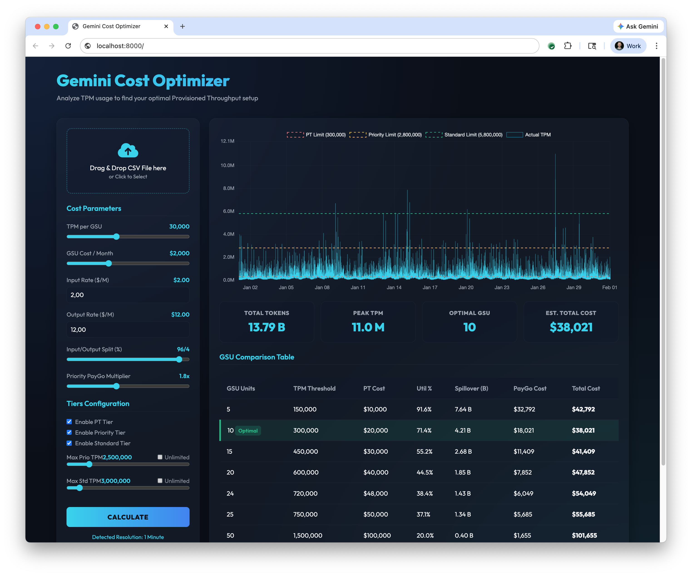

# Vertex AI Gemini Cost Calculator App

This client-side single-page application analyzes LLM token usage (Tokens Per Minute — TPM) timeseries data to calculate and find the optimal Provisioned Throughput (GSU) configuration on Gemini Vertex AI.

🚀 **Try it live:** [https://antonpp.github.io/gemini-cost-calc/](https://antonpp.github.io/gemini-cost-calc/)



---

## ⚙️ Running Locally

Clone the repository and start a local server:
```bash
git clone https://github.com/antonpp/gemini-cost-calc.git
cd gemini-cost-calc
python3 -m http.server 8080
```
Then open **[http://localhost:8080/](http://localhost:8080/)** or use the test URL **[http://localhost:8080/?test=true](http://localhost:8080/?test=true)**.

---

## ☁️ Cloud Shell Quickstart (Fetch Real GCP Data)

The included `utils/fetch_tpm.py` script queries **GCP Cloud Monitoring** for your project's Vertex AI token usage and generates CSV files ready to load directly into the app — no manual export or drag-and-drop required.

### Prerequisites

- A GCP project with Vertex AI generative model usage
- `roles/monitoring.viewer` IAM role on the project (Cloud Shell's default credentials usually have this)

### Steps

```bash
# 1. Clone the repo (inside Cloud Shell)
git clone https://github.com/antonpp/gemini-cost-calc.git
cd gemini-cost-calc

# 2. Create a virtual environment and install dependencies
python3 -m venv .venv
source .venv/bin/activate
pip install -r requirements.txt

# 3. Run the fetch script
python3 utils/fetch_tpm.py --project YOUR_PROJECT_ID

# 4. Serve the app on the Cloud Shell Web Preview port
python3 -m http.server 8080
```

### Interactive prompts

The script uses interactive arrow-key menus (via [questionary](https://github.com/tmbo/questionary)):

**Step 1 — Timeframe** (arrow keys to navigate, Enter to confirm)
```
? Select timeframe:
  Last 24 hours
  Last week
❯ Last month
  Last 3 months
```

**Step 2 — Model selection** (Space to toggle, Enter to confirm, all checked by default)
```
? Select models to export (one CSV per model):
 ◉ gemini-2.5-flash-lite  (1.2M tokens)
 ◉ gemini-3-flash-preview  (847.2M tokens)
 ◯ gemini-3.1-pro-preview  (91.5K tokens)
```

**Step 3 — Combined CSV** (only shown if 2+ models selected)
```
? Also generate a combined CSV (all selected models merged)? (y/N)
```

### Click-to-load URLs

After writing the CSV files the script prints a URL for each file:

```
  [gemini-3-flash-preview]
  http://localhost:8080/?file=tpm_gemini-3-flash-preview.csv

  [gemini-3.1-pro-preview]
  http://localhost:8080/?file=tpm_gemini-3_1-pro-preview.csv
```

Click a link in the Cloud Shell Web Preview to load that model's data directly into the app — no drag-and-drop needed.

> [!TIP]
> If the Cloud Shell Web Preview rewrites the port, use the **Change Port** option (top-right of the preview window) and select port `8080`.

### Script options

| Flag | Default | Description |
|------|---------|-------------|
| `--project` | *(required)* | GCP project ID to query |
| `--out-dir` | `.` | Directory to write CSV files into |
| `--port` | `8080` | Port the app is served on (used to build the click-to-load URLs) |
| `--no-server` | off | Skip printing localhost URLs |

---

## 📊 Expected CSV Format

The dashboard expects a CSV with at least `time` and `tpm` columns:

```csv
time,tpm
2026-03-12T10:00:00Z,4500000
2026-03-12T10:01:00Z,4720000
2026-03-12T10:02:00Z,5100000
```

> [!NOTE]
> **Data Resolution**: The calculator automatically detects the bucket interval from the timestamps (e.g. 1-minute, 5-minute). The `tpm` value is treated as the average token rate within each bucket.

---

## ✨ Features

- **Drag-and-drop or click-to-load CSV** — works in both local browser and Cloud Shell
- **URL-based file loading** — open `?file=<path>` to load a CSV served by the local HTTP server
- **Interactive TPM chart** with drag-to-zoom and reset
- **GSU sweep optimizer** — finds the minimum-cost Provisioned Throughput configuration
- **Multi-tier modelling** — PT / Priority PayGo / Standard PayGo waterfall
- **Model presets** — one-click population of rates and capacity limits per Gemini model

---

## 📂 Project Structure

| Path | Description |
|------|-------------|
| `index.html`, `style.css`, `app.js` | Single-page app (zero server-side dependencies) |
| `utils/fetch_tpm.py` | GCP Monitoring fetch script — generates CSVs from real usage data |
| `utils/fix_csv.py` | Utility to reformat CSVs with non-standard column names |
| `reference_scripts/` | Reference Python scripts used during development |
| `spec/` | Design and functional specifications |
